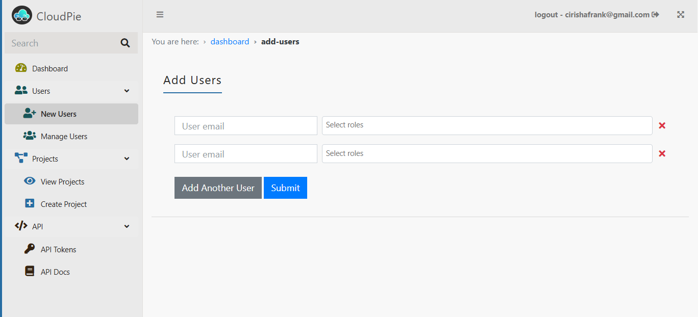
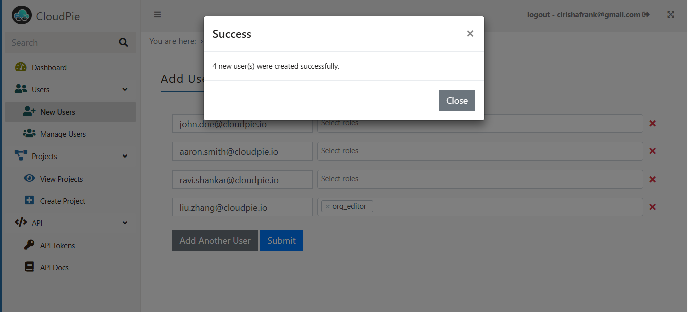

To add users to the application:

1. Navigate to the **Dashboard** and click on the **"Add Users"** menu in the sidebar.
2. This will open the **Add Users** form, where you can add multiple users by entering their email addresses.
3. Optionally, you can assign one or more **Organization-level roles** to the users using the dropdown menu. 
   - **Note:** Assign Org-level roles only if the user requires permissions beyond specific projects. For example:
     - If a user needs to manage the organization as a whole, assign appropriate Org-level roles.
     - If the user will only perform tasks specific to a project, **no Org-level role is needed**—they will be assigned roles at the project level instead.

4. Once you’ve entered the details, click **Submit** to save the changes.

***Example Image 1: Add one or more users***

***Example Image 2: Add users, select roles and Submit***

