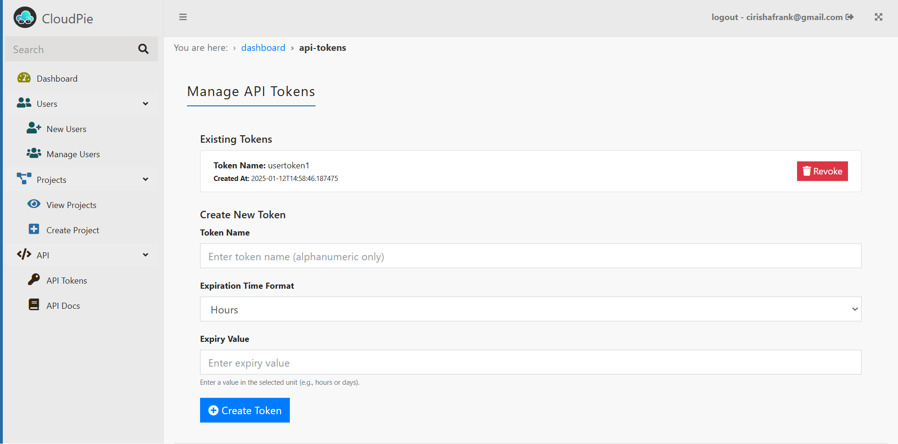
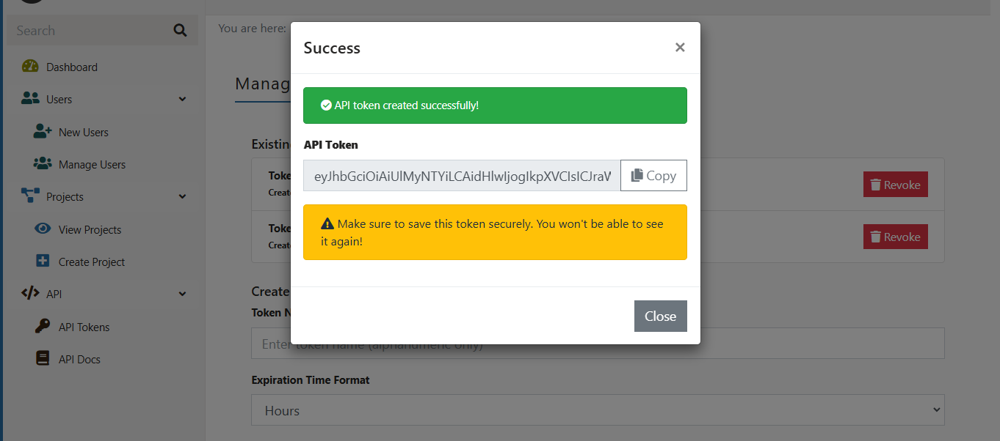

# Managing API Tokens

API tokens allow users to perform operations based on their permissions at the organization or project level. Users can generate or revoke tokens from the API Tokens management page.

---

- Navigate to the **API Tokens** section in the sidebar under the **API** menu.
- The page displays existing tokens:
  - **Existing Tokens**: A list of token names and their creation timestamps. Users can revoke tokens by clicking the **Revoke** button next to the token name.

**_Example Image: API Token Management Page_**

- To create a new token:
  - Enter an alphanumeric token name.
  - Select the expiration time format (e.g., hours or days).
  - Specify the expiration value.
  - Click **Create Token**.

**_Example Image: Generated API Token_**

- Once the token is created, it will be displayed **only once**:
  - Users must save the token securely as it cannot be retrieved later.
