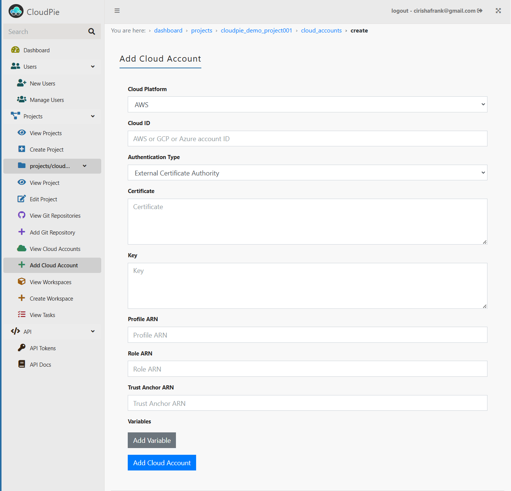

# Adding Cloud Accounts

A cloud account represents your specific account within a cloud provider platform (AWS Account, GCP Project, or Azure Subscription). You can authenticate these accounts using either existing shared credentials or account-specific credentials.

## Prerequisites
- An active CloudPie project
- User with roles that has permissions to create Cloud Cloud Accounts.

## Step-by-Step Guide

1. **Access the Project:**
   - Navigate to the **Dashboard** and select your project
   - Locate the **"Add Cloud Account"** menu in the sidebar

2. **Fill Out the Account Details:**
   - **Select the Cloud Platform:** Choose from:
     - **AWS**: Example account ID: `123456789012`
     - **GCP**: Example project ID: `my-project-123456`
     - **Azure**: Example subscription ID: `11111111-2222-3333-4444-555555555555`
   - **Specify the Cloud Account ID** for your chosen platform

3. **Choose Authentication Method:**
   You have two options for authentication:

   ### Option 1: Use Existing Credentials
   - Select **"Use Existing Credentials"**
   - Choose from available credentials in the dropdown lookup

   ### Option 2: Create Account-Specific Credentials
   - Select **"Provide New Credentials"**
   - Choose the authentication type
   - Provide the required credential details
   - These credentials will be used only for this cloud account

4. **Add Variables and Secrets (Optional):**
   - Add custom variables and secrets for Terraform workspace injection
   - Secrets are encrypted and decrypted just-in-time during runs

5. **Submit:**
   - Review all details
   - Click **Submit** to create the cloud account

## Important Notes
- Account-specific credentials work the same way as shared credentials but are only available to this cloud account
- The authentication requirements are identical for both credential types
- You can switch between credential types later by editing the cloud account

---