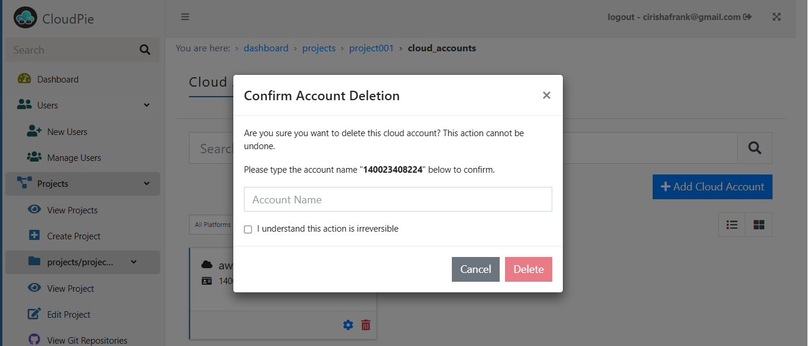

To Remove a cloud account from Cloudpie, follow these steps:

1. **Access the Project:**
   - Navigate to the **Dashboard** and select the project containing the cloud account you want to delete.
   - Once inside the project, locate and click on the **"View Cloud Accounts"** menu in the sidebar.

2. **Search for the Cloud Account:**
   - Use the search bar to locate the specific cloud account by its **Cloud Account ID**.

3. **Delete the Cloud Account:**
   - In the search results, click on the **Delete Cloud Account** icon next to the account you want to remove.

4. **Confirm Deletion:**
   - A confirmation box will appear. Carefully review the warning and confirm the deletion by clicking **Confirm**.

   > **Note:** Deleting a cloud account is an **irreversible action**. All metadata and associations related to the cloud account will be permanently removed from Cloudpie. However:
   - **Your actual cloud resources will not be affected.**
   - This operation only removes the cloud account’s association within Cloudpie and cleans up its metadata.

***Example Image: Delete/Remove Cloud Account***

