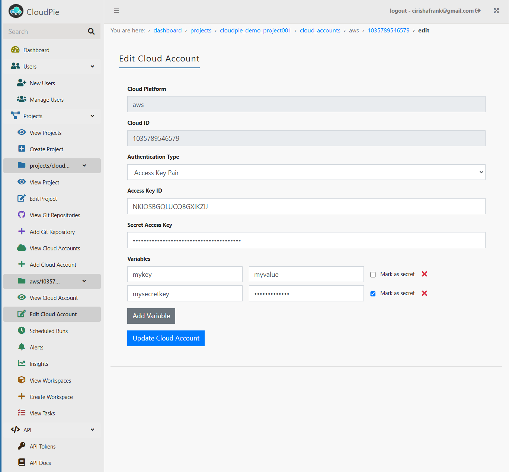

To edit an existing cloud account:

1. **Access the Project and Cloud Account:**
   - Navigate to the **Dashboard** and select the project where the cloud account is located.
   - Open the specific cloud account you want to edit.
   - In the sidebar, locate the **"Edit Cloud Account"** menu.

2. **Open the Edit Cloud Account Form:**
   - Click on the **"Edit Cloud Account"** menu to open the form.
   - The form will display the existing details of the cloud account, pre-populated for editing.

3. **Update the Details:**
   - Modify any of the following fields as needed:
     - Cloud platform and account ID (e.g., AWS, GCP, Azure)
     - Authentication type and credentials
     - Variables and secrets

4. **Save Changes:**
   - Once you’ve updated the necessary information, click **Save** to apply the changes.

***Example Image: Update/Edit Cloud Account Form***

