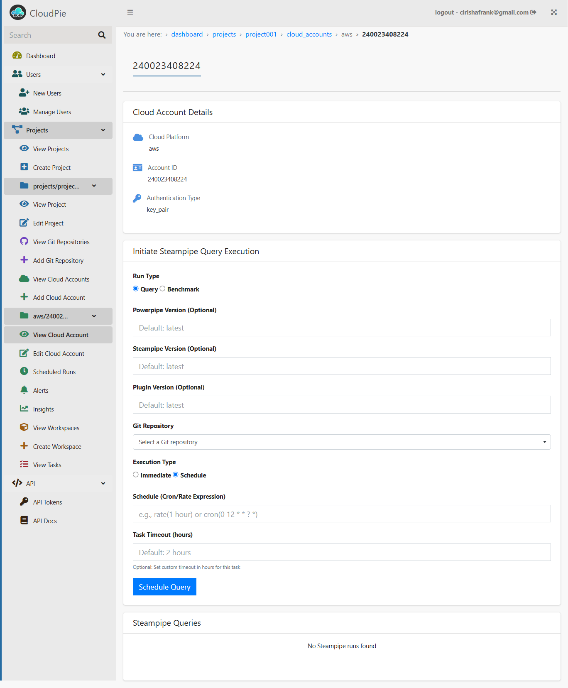
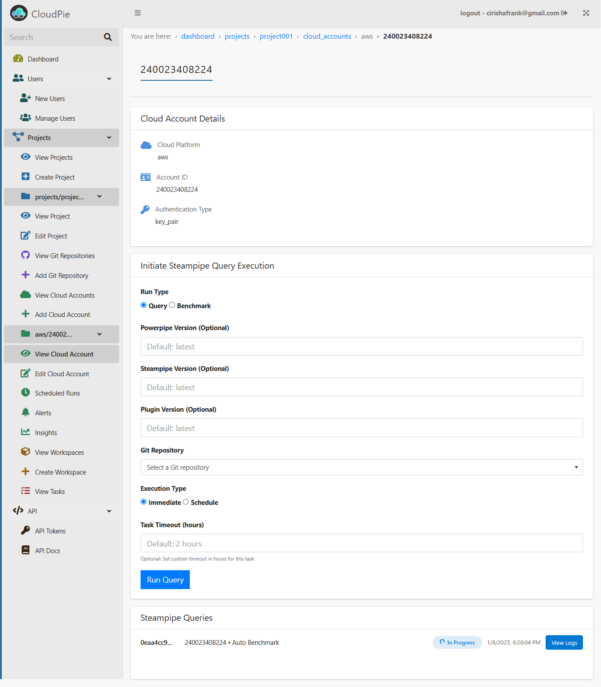
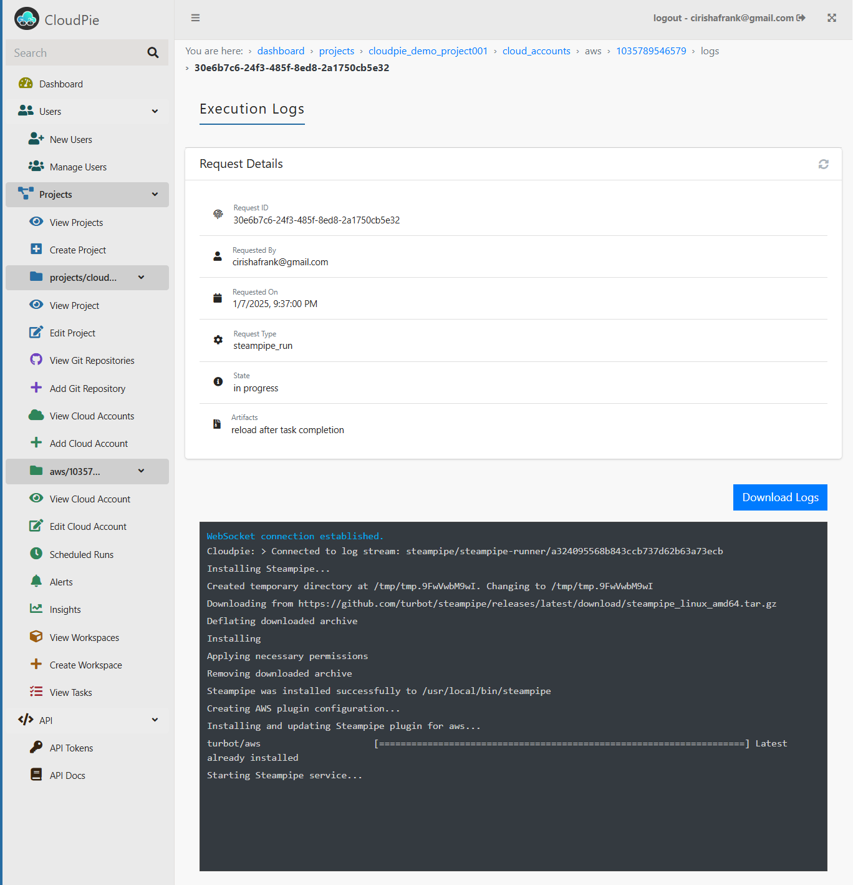
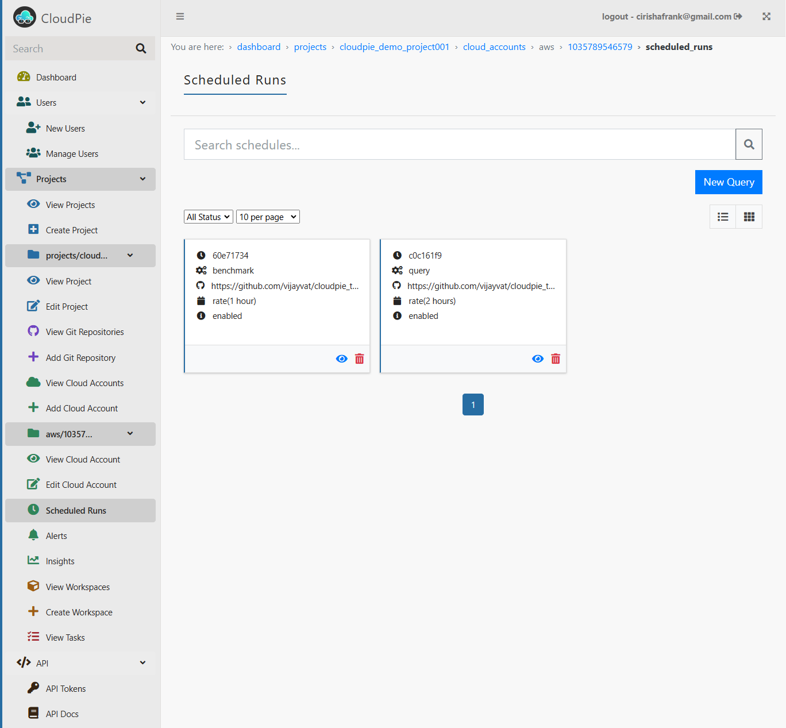

# Querying Cloud Resources

Cloudpie allows you to query your cloud resources directly from within the platform, providing flexible options to either run queries immediately or schedule them for periodic execution. This section will guide you through the steps for both approaches and how to manage queries effectively.

---

### Executing a Query

To execute a query for a specific cloud account:

1. Access the Cloud Account Page:
   - Navigate to the **Dashboard**, select the project, and open the **View Cloud Accounts** menu.
   - From the list of cloud accounts, click on the **Settings icon** for the desired account to open its **Cloud Account Page**. Here, next to the basic cloud account details, you will find the Steampipe Query Execution form.

   ***Example Image: Cloud Account Page***

   

2. **Fill Out the Query Execution Form:**
     - **Query**: Select this option to execute custom Steampipe SQL queries from a Git repository.
     - **Benchmark**: Select this option to execute the latest CIS benchmark for the associated cloud platform.
     - **Powerpipe Version (optional)**: Specify the Powerpipe version to use, or leave it as the default (`latest`).
     - **Steampipe Version (optional)**: Specify the Steampipe version to use, or leave it as the default (`latest`).
     - **Plugin Version**: Specify the plugin version to use, or leave it as the default (`latest`).
     - **Git Repository (For Query Runs):** Use the dropdown to search and select a Git repository registered within the project. Ensure the repository contains valid `.sql` files and the `steampipe_queries_path` is set to a path containing the `.sql` files
   - **Execution Type:**
     - **Immediate**: Executes the query as soon as you submit the form.
     - **Schedule**: Allows you to configure a schedule for recurring query execution.
   - **Task Timeout (Optional):**
     - Specify a custom timeout in hours for the task, or leave it as the default (`2 hours`).
   - **Submit the Form:**
     - Once all fields are completed, click **Run Query** to execute the query.
---     
### Immediate Run
   - If a query or benchmark is run with Execution Type set to Immediate, the request is tracked directly on the Cloud Account page.
   - An entry showing the **status of the query** appears dynamically, updating in real time.

   ***Example Image: Form submission and query status***

   

   - Use the **View Logs** button to:
     - **Tail live Execution logs** for active runs.
     - Access and **download Execution logs** for completed runs.
     - **Download CSV output of query results** once the run is completed. 

   ***Example Image: Query execution Logs***

   

---

### Scheduling Queries

To schedule a recurring query for a cloud account:

   - In the Query Execution Form on the **Cloud Account Page**, select the **Scheduled Run** option for **Execution type**, instead of **Immediate**.
   - Choose one of the following scheduling methods:
     - **Cron Expression**: Specify a cron pattern (e.g., `0 0 * * *` for daily runs at midnight).
     - **Rate Expression**: Define the interval (e.g., `rate(2 hours)` for every 2 hours).
   - After scheduling a query, navigate to the **"Scheduled Runs"** menu in the sidebar for the selected cloud account. 
   - This page should now include the query run that was scheduled, including the other scheduled query runs scheduled in that cloud account.

   ***Example Image: Scheduled Runs Page***

   
---
### Manage Scheduled Runs
   - To manage a scheduled run, click on a specifc run to open a page containing additional details and all the periodic runs created by that schedule.
   - Enable or disable a scheduled run to pause or resume execution as needed.
   - On the same page view all historical runs associated with it.
   - For each run created by the schedule you can view the logs. Click **View Logs** against the run to:
     - **Tail live Execution logs** for active runs.
     - Access and **download Execution logs** for completed runs.
     - **Download CSV output of query results** once the run is completed. 
---

### Notes on Querying Cloud Resources

- **Git Repository Integration:** Ensure the repository is registered in the project and contains valid `.sql` files for Steampipe queries. Ensure that the `steampipe_queries_path` is configured for the repository that is registered.
- **Auto Benchmark:** This option automatically runs the latest CIS benchmark for the selected cloud platform, requiring no additional configuration.
- **Logs and Status Updates:** The logs and status updates for both immediate and scheduled runs are dynamically updated to provide real-time insights.
- **Downloadable Artifacts:** Query results are available as **CSV files** for download. These can be used in:
  - **ETL Pipelines**: Transform and load the data into other systems.
  - **AI Operations**: Feed the data into AI/ML tools for advanced analytics and insights.
