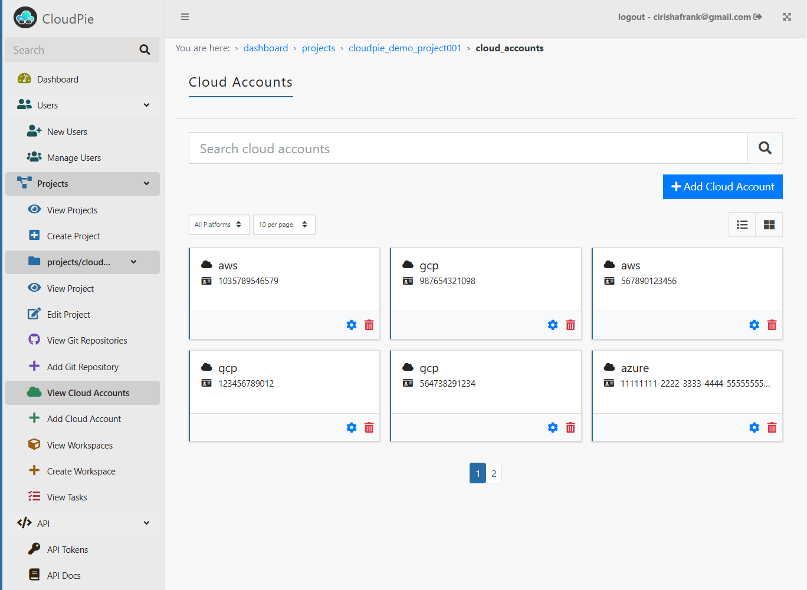

### Viewing All Cloud Accounts

To view and manage cloud accounts associated with a project:

1. Navigate to the **Dashboard** and select the project you want to manage.
2. In the sidebar, click on the **"View Cloud Accounts"** menu.
3. This will display a **paginated list** of all cloud accounts linked to the selected project.
4. Use the **Search bar** to quickly locate a specific cloud account by its **Cloud Account ID**.
5. To narrow down the list, use the **Filter by Platform Type** dropdown to display accounts for a specific cloud platform (e.g., AWS, GCP, or Azure).

***Example Image: View Cloud Accounts***

---

### Viewing Individual Cloud Accounts

To view details of a specific cloud account:

1. From the **Cloud Accounts** list, click on the **Settings icon** next to the cloud account you want to view.
2. This will take you to the **Cloud Account Page**, which provides:
   - **High-level details** of the selected cloud account.
   - A **form to manage queries** that allows you to extract more detailed data from the linked account.

Use the form to configure and execute queries as needed to fetch specific information about the cloud account.

***Example Image: View Individual Cloud Account***

