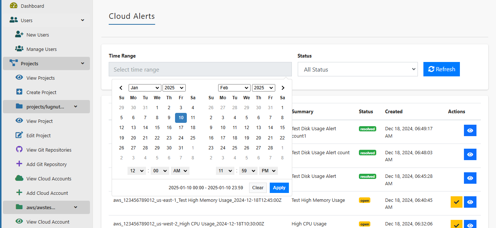
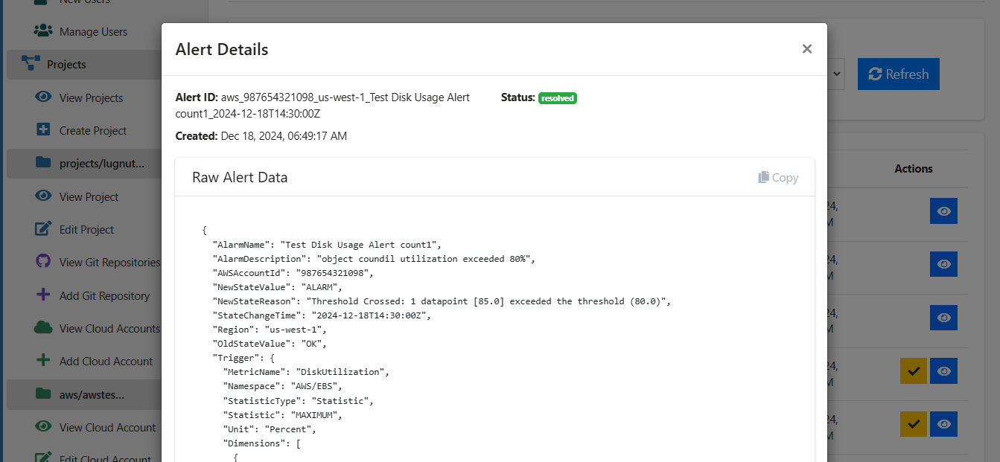
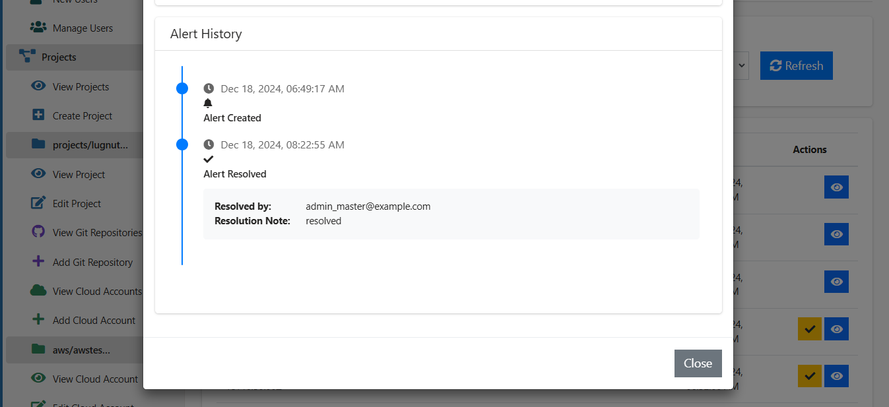
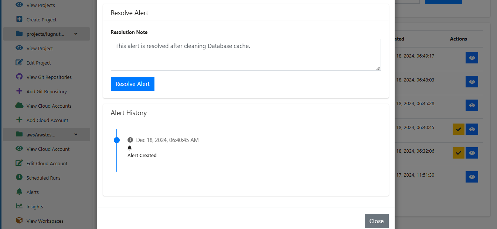

# Managing Alerts

Cloudpie enables users to view, configure, and resolve alerts for cloud accounts. Alerts can be auto-resolved when the cloud platform reports them as no longer an issue or manually resolved with a resolution note. This document explains how to navigate the alerts page, configure alerts for different cloud platforms, view alert details, and resolve alerts.

---

## Viewing Alerts

1. Navigate to the **Dashboard** and select the project.
2. Select the **Cloud Account** for which you want to view alerts.
3. Click on the **"Alerts"** menu in the sidebar.
4. Use the following filters to refine the alerts list:

    - **Time Range**: Specify a date range to view alerts created within that period.
    - **Status**: Filter alerts by status (e.g., **Open**, **Resolved**).

5. Click the **Refresh** button to load the latest alerts.

***Example Screenshot: Alerts Page***



---

## Configuring Alerts in Cloud Platforms

To configure alerts, use Cloudpie’s API endpoints. Below are the configurations for AWS, GCP, and Azure:

### AWS Alert Configuration

1. Use the AWS Management Console, CLI, or SDK to create a CloudWatch alarm.
2. Set the **alarm action** to trigger an HTTP POST request to Cloudpie's alerts endpoint:

    ```plaintext
    POST https://<cloudpie-url>/api/v1/projects/{project_name}/cloud_accounts/aws/{account_id}/alerts
    ```

**Example Payload:**

    
    {
      "AlarmName": "High CPU Usage",
      "AWSAccountId": "123456789012",
      "Region": "us-west-2",
      "StateChangeTime": "2025-01-10T10:30:00Z",
      "NewStateValue": "ALARM",
      "NewStateReason": "CPU utilization exceeded 80% threshold",
      "Trigger": {
        "MetricName": "CPUUtilization",
        "Namespace": "AWS/EC2",
        "StatisticType": "Statistic",
        "Statistic": "AVERAGE",
        "Unit": "Percent"
      }
    }

### GCP Alert Configuration

1. Create an alerting policy using the Google Cloud Console or Monitoring API.
2. Configure a **webhook notification channel** pointing to Cloudpie’s endpoint:

    ```plaintext
    POST https://<cloudpie-url>/api/v1/projects/{project_name}/cloud_accounts/gcp/{account_id}/alerts
    ```

**Example Payload:**

    
    {
      "incident_id": "12345-67890",
      "state": "open",
      "resource_name": "projects/my-project-id",
      "policy_name": "High CPU Usage",
      "condition_name": "CPU Utilization Exceeds 80%",
      "condition_threshold_value": 80,
      "condition_threshold_unit": "percent",
      "start_time": "2025-01-10T10:30:00Z"
    }

### Azure Alert Configuration

1. Use the Azure Portal or CLI to create an alert rule.
2. Add an **action group** configured with a webhook pointing to Cloudpie’s endpoint:

    ```plaintext
    POST https://<cloudpie-url>/api/v1/projects/{project_name}/cloud_accounts/azure/{account_id}/alerts
    ```

**Example Payload:**

    
    {
      "data": {
        "essentials": {
          "alertId": "abc123",
          "severity": "Sev3",
          "signalType": "Metric",
          "monitorCondition": "Fired",
          "alertRule": "High Disk Usage"
        },
        "alertContext": {
          "condition": {
            "metricValue": 85,
            "threshold": 80
          }
        }
      }
    }
    

---

## Viewing Alert Details

1. From the alerts list, click the **View Alert** icon next to the alert you want to view.
2. The alert details page provides:
   - **Metadata**: Includes ID, creation time, and status.
   - **Raw Alert Payload**: Displays the original alert data received from the cloud platform.
   - **Alert History**: Shows a timeline of changes to the alert’s state.

***Example Screenshot 1: View Alert Details***



***Example Screenshot 2: View Alert Details***



---

## Resolving Alerts

1. From the alerts list, click the **Resolve Alert** button next to an open alert.
2. Enter a **Resolution Note** describing the resolution action.
3. Click **Resolve Alert** to mark the alert as resolved.
4. The alert’s status is updated, and the resolution note is logged in the alert history.

***Example Screenshot: Resolving an Alert***



---

## Notes

- Alerts can be auto-resolved when the cloud platform reports that the condition causing the alert is no longer active.
- Use the refresh button on the alerts page to fetch the latest data.
