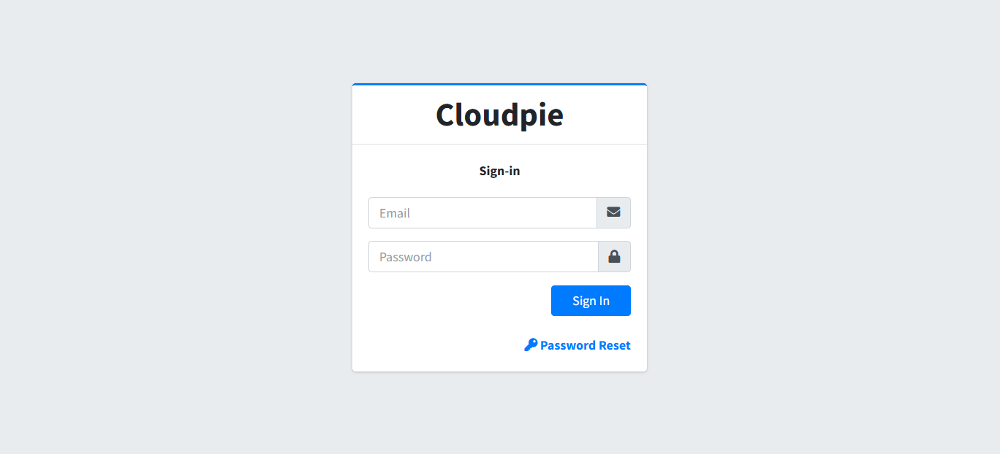

# Getting Access to Cloudpie

### **Registration**
To get started with Cloudpie,

1. Visit [cloudpie.io](https://cloudpie.io).
2. Use the **Contact Form** to submit your request for access.
3. Once you submit your interest to procure the service, a Cloudpie representative will contact you with a questionnaire to assist with your onboarding process.
4. Once on-boarded, you will receive an email with further instructions to help you get started.

### **Access Your Dashboard**
Upon approval, you will be assigned a custom domain for your organization, such as `your-organization.cloudpie.io`.

Use the login page on your domain to access the Cloudpie dashboard.

