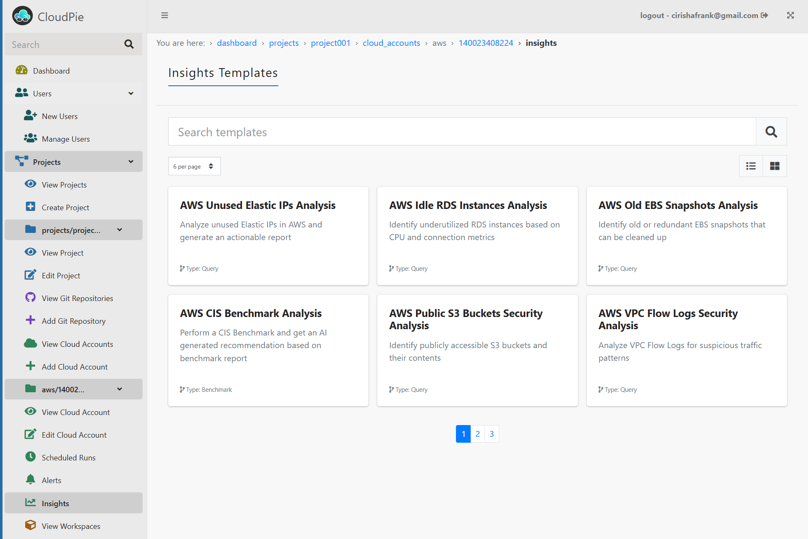
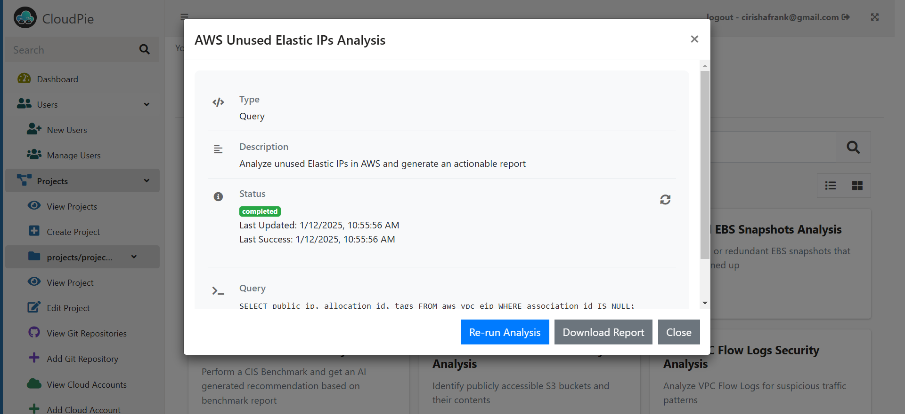

# Insight Templates

Insight templates are pre-defined Steampipe queries designed to analyze specific aspects of your cloud accounts and provide actionable insights. These queries are processed through OpenAI for further analysis, and the resulting report is available for download.

---

## Accessing Insight Templates

1. Navigate to the **Cloud Account** section within the desired project.
2. Select the **"Insights"** menu in the sidebar.
3. The page will display a list of available templates relevant to the selected cloud platform (e.g., AWS templates for AWS accounts).

***Example Image: Insights Templates Page***

---

## Using an Insight Template

1. Click on an insight template card to open the details.
2. The details include:
   - The **query** being executed.
   - **Description** of the template.
   - **Status** indicating the last run's result:
     - Success (with the timestamp).
     - Failure (with the error message, if any).
   - **Re-run Analysis** and **Download Report** options.

***Example Image: Insight Template Details***

3. Click the **Run Analysis** button to execute the query. You can track its progress in real-time.
4. Once the analysis is completed, the generated Markdown (MD) report will be available for download.
5. Users can re-run the analysis at any time to generate a new report.

---

## Notes
- Insight templates are specific to the cloud platform associated with the account.
- The generated MD reports can be used for further ETL or analysis tasks.
- Failed analyses can be retried after reviewing the error details.
