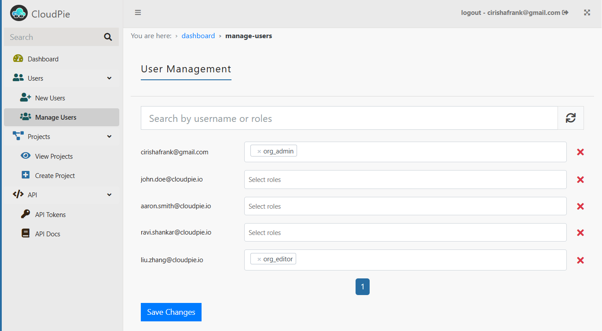

### Managing and Removing Users

To manage users or remove users from the application:

1. Navigate to the **Dashboard** and click on the **"Manage Users"** menu in the sidebar.
2. This will open the **Manage Users** page, which lists all existing users and their associated organization-level roles in a **paginated view**.
3. Use the **Search** form to quickly locate a specific user if needed.
4. From this view, you can:
   - Make changes to the assigned roles of one or more users.
   - Remove users from the application entirely.

5. After making the necessary changes, click **Save** to update the user information.

Below is a screenshot showing the Manage Users page:

