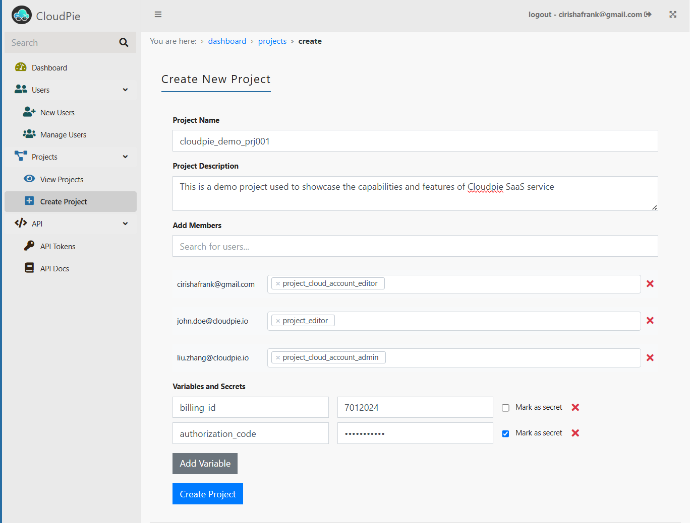

# Creating Projects

Learn how to create and configure new projects in CloudPie.

## Prerequisites
- Users must be already onboarded to CloudPie
- User that has Org level permissions to create project

## Creating a Project

1. Navigate to the **Dashboard** and click **Create Project** in the sidebar

2. Fill out the project details:
   - **Project Name** (required)
   - **Description** (optional)

3. Add Project Members:
   - Enter email addresses of existing CloudPie users
   - Assign one or more project roles (see [Project Roles](project-roles.md) for details)

4. Configure Optional Settings:
   - Add project variables
   - Set up project secrets

5. Click **Submit** to create the project

## Important Notes
- Users can be assigned multiple roles
- All role assignments can be modified later
- Variables and secrets are stored securely

---