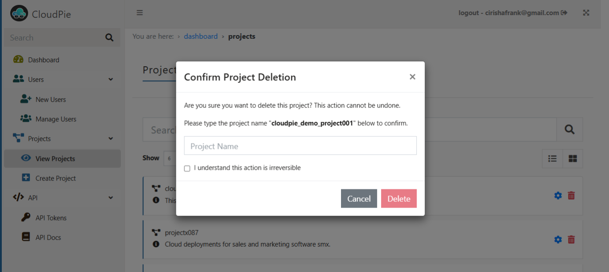

# Deleting Projects

Learn how to safely remove projects and their associated resources from CloudPie.

## Prerequisites
- Organization-level permissions to delete projects
- Understanding of resources that will be affected

## Deletion Process

1. Navigate to the **Dashboard**
2. Click **View Projects** in the sidebar menu
3. Locate the project you want to delete
4. Click the delete (trash) icon next to the project
5. In the confirmation dialog:
   - Review the warning message
   - Type the project name to confirm
   - Click **Delete** to permanently remove

## Impact of Deletion
Deleting a project permanently removes:
- All cloud accounts and their configurations
- Git repository connections
- Workspace configurations and state
- Stored credentials
- Project variables and secrets
- User access assignments
- Query configurations and history
- Insight data and reports

## Important Notes
- Deletion cannot be undone
- Verify no active deployments are running
- External resources (cloud infrastructure, git repos) are not affected
- All team members will lose access to the project
- Consider exporting any important data before deletion

---