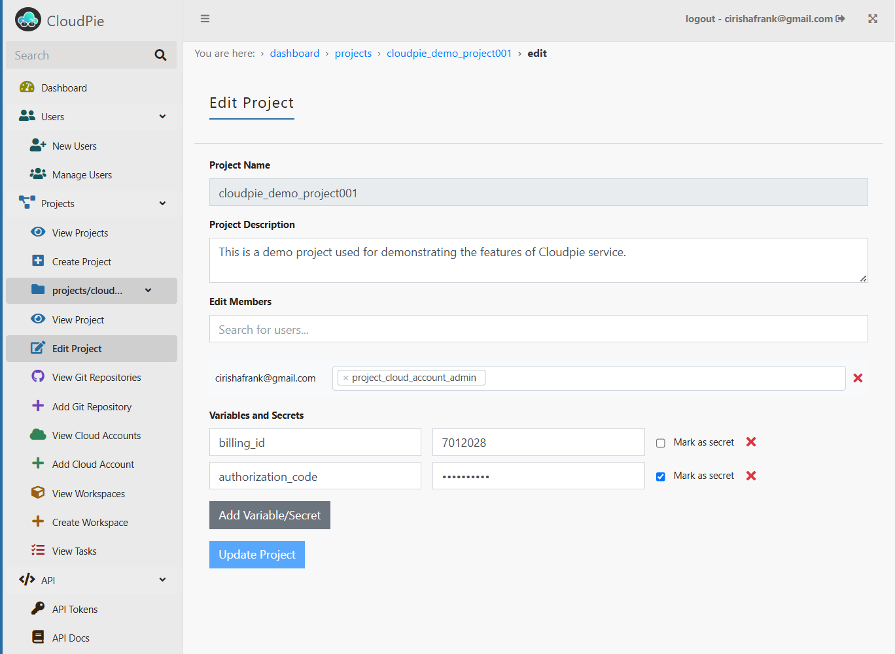

### Editing a Project

To make changes to an existing project, follow these steps:

1. Navigate to the **"View Projects"** page from the sidebar and select the project you want to update.
2. This will take you to the **Project Dashboard** for the selected project.
3. In the sidebar, under the selected project, the **"Edit Project"** menu will become available. Click on it to access the **Edit Project** page.
4. On the **Edit Project** page, your existing project settings will be displayed in a pre-populated form.
5. Make the necessary updates, such as:
   - Updating the project description.
   - Managing users and their permissions.
   - Modifying variables and secrets.
6. Once you've made your changes, click **Submit** to save the updates.

***Example Image: Delete Project Form***

