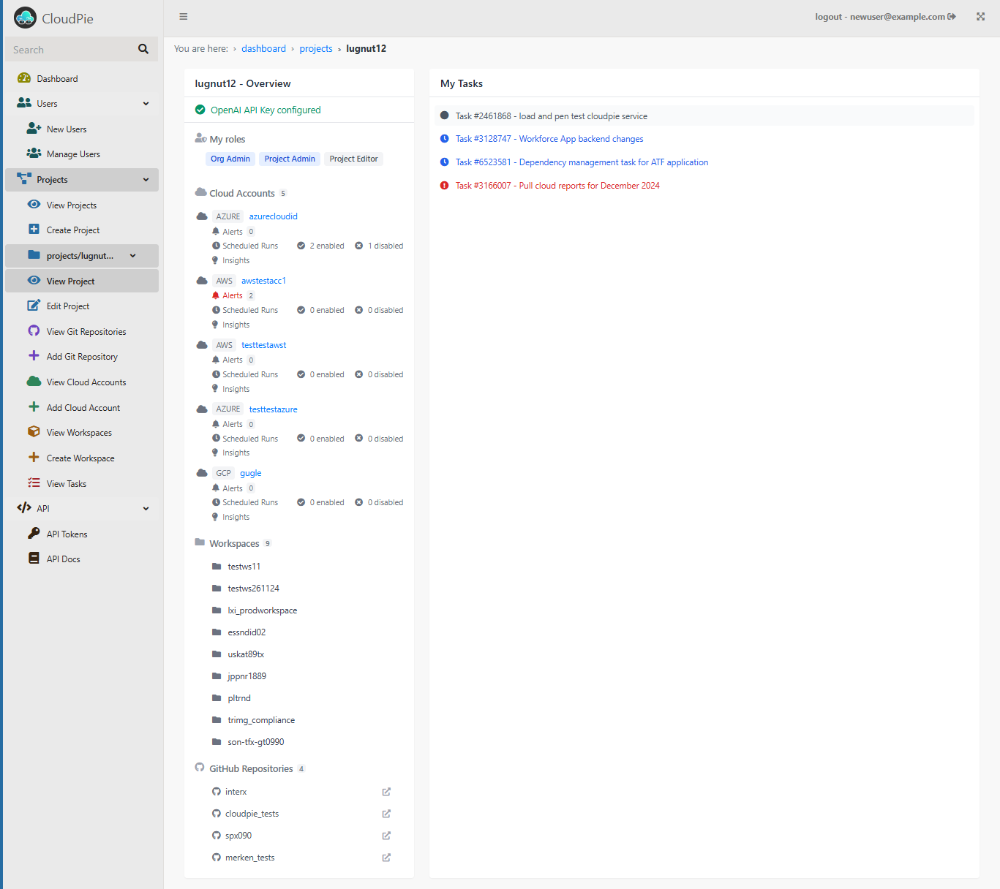

### Viewing All Projects

To view the projects you have created:

1. Navigate to the **View Projects** page by selecting the corresponding option in the sidebar.
2. This will display a list of all the projects you have created.

Below is a screenshot showing an example of the created projects:

---

### Viewing a Specific Project

To view the details of a specific project:

1. Click on the **Settings icon** next to the project you want to view. 
2. This will open the project's dashboard, providing you with a high-level overview of its various objects and resources.
3. Once you access the project's dashboard, the **sidebar** dynamically updates to display **additional links**. These links allow you to efficiently manage project-level resources, such as cloud accounts, users, variables, and more.

Below is a screenshot showing an example of the project dashboard:

