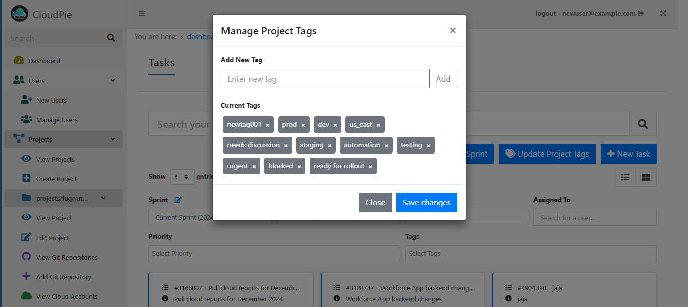

# Managing Tasks in Projects

The **Tasks** section allows users to manage project tasks efficiently. Users can create, edit, and delete tasks, manage task relationships, and filter tasks based on various criteria. Below are the detailed steps for each action:

---

## Accessing the Tasks Section

1. Navigate to the **Dashboard** and select the desired project.
2. Click on the **Tasks** menu in the sidebar scoped to the selected project.
3. The **Tasks** page will open, displaying:
    - A **search bar** to search tasks by title or ID
    - **Dropdown filters** to refine tasks by:
        - **Sprint**
        - **Task Type**
        - **Status**
        - **Assigned To**
        - **Priority**
        - **Tags**
    - Tasks displayed in **card view**

***Example Image: Viewing Tasks***

---

## Managing Sprints

### Creating a Sprint

1. Click the **Create Sprint** button to open the sprint creation dialog.
2. Fill in:
    - **Start Date**
    - **End Date**
    - **Sprint Goal**
3. Note:
    - Sprints are **sequential** and named automatically based on the year
    - Sprint dates **cannot overlap** with other sprints

***Example Image: Creating a Sprint***

### Editing a Sprint

1. Use the **Edit Sprint** button located next to the sprint filter dropdown.
2. Update the sprint's **start date**, **end date**, or **goal**.
3. Sprint dates still **cannot overlap** with existing sprints.

***Example Image: Editing a Sprint***

---

## Managing Tags

1. Click the **Update Project Tags** button to open the tag management dialog.
2. Add or remove tags that can be used for task filtering.

***Example Image: Managing Tags***

---

## Managing Tasks

### Creating a Task

1. Click the **New Task** button to open the task creation dialog.
2. Fill in:
    - **Title** and **Description**
    - **Due Date**
    - **Tags**
    - **Priority**
    - **Assigned To**
    - Whether the task should be added to a **backlog** or a specific **sprint**
3. Add task **relationships** (e.g., Parent of, Blocked by, etc.).

***Example Image: Creating a Task***

---

### Editing a Task

1. Click the **Edit Task** icon on an existing task to open the task editing dialog.
2. Make changes to the task details, such as title, description, or assigned sprint.
3. Add comments to the task for discussions.

***Example Image: Editing a Task***

---

### Deleting a Task

1. Click the **Delete Task** icon on an existing task.
2. Confirm the deletion in the confirmation dialog.
    - Once deleted, the task and its relationships will be removed.

***Example Image: Deleting a Task***

