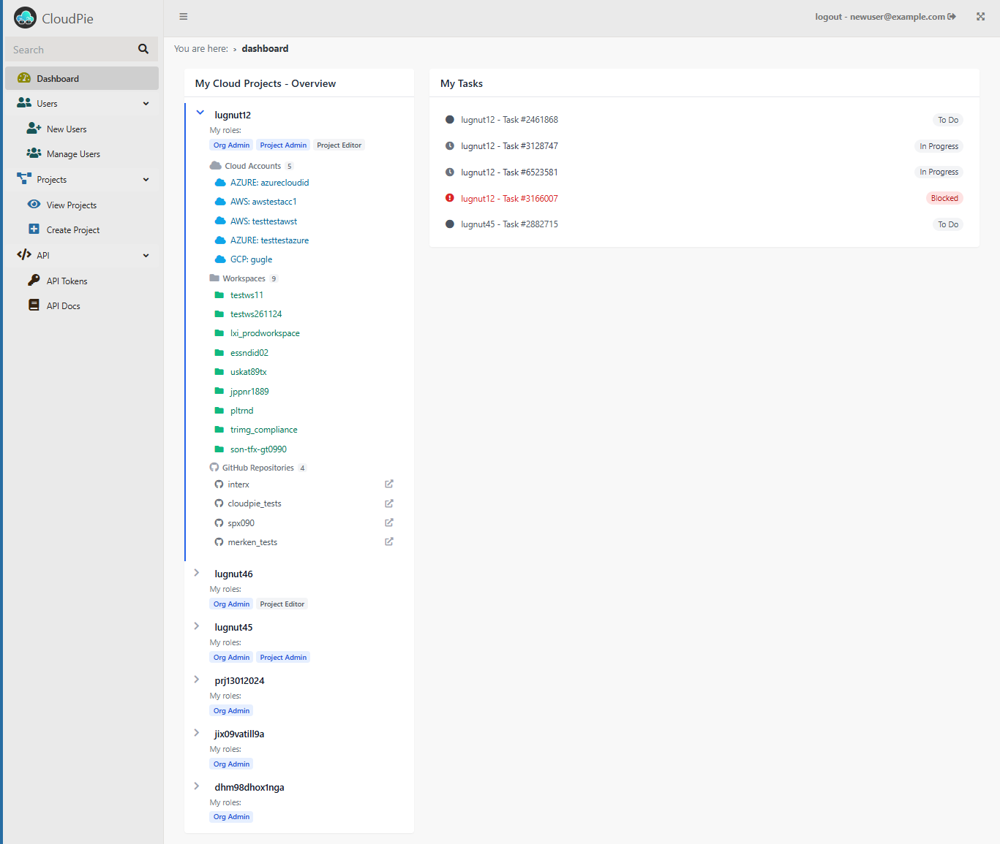

# Understanding Cloudpie Design

Cloudpie is built with a structured hierarchy to streamline the organization and management of your cloud resources, empowering you to perform DevOps operations with greater efficiency and precision.

---

### **Accessing Cloudpie Dashboard**

- **Domain**: Your organization will have a custom domain, e.g., `your-organization.cloudpie.io`.
- **Admin Access**: During the registration process, you provide an admin email. This user is pre-created for you.
- Use the **Reset Password** link on the login page to set a new password.
- A dashboard in Cloudpie is your landing page to the rest of the Application, providing high level overview of all objects.

***Example Image: Cloudpie Dashboard***

---

### **Hierarchy**

Cloudpie follows this hierarchy:
1. **Cloud Projects**:
   - A Cloud Project serves as the central hub for all your Cloud DevOps activities
   - Its hierarchy is structured to help you efficiently organize and manage your daily Cloud DevOps tasks.

2. **Git Repository Connections**
   - Add one or more Git repositories to you project.
   - The Git repositories is your source for IaC Terraform Code, SQL files containing cloud queries and other similar configurations.

3. **Cloud Accounts**:
   - Link your AWS, GCP, or Azure accounts to a project.
   - Perform tasks like running or scheduling queries & exporting data, receive Alerts from Cloud Platforms.
   - Run CIS benchmark checks and Trigger Insight templates to get targetted insights powered by Steampipe

4. **Workspaces**:
   - Leverage workspaces for seamless Terraform deployments, efficient state file management, and comprehensive log file access. 
   - Tail logs in real-time or retrieve and download them for detailed analysis.

5. **Users**:
   - Add and manage users in your organization by their email addresses.
   - Add users to one or projcets
   - Assign different built-in Cloudpie roles for users in different projects.

6. **Tasks**:
   - Create sprint, add tasks and assign it to users.
   - Manage state of tasks, add comments etc to track progress.

---