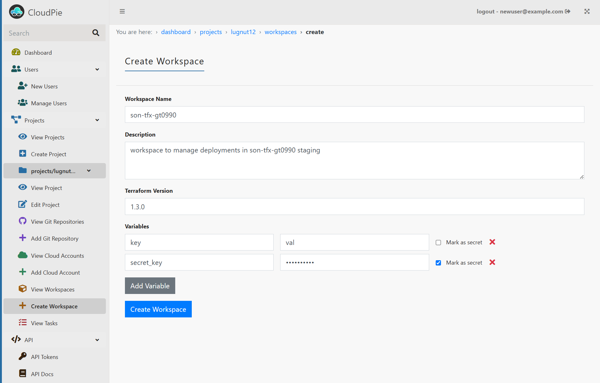

### Adding a Workspace

To add a workspace, follow these steps:

1. **Access the Project:**
   - Navigate to the **Dashboard** and select the project where you want to create the workspace.
   - Once inside the project, locate the **"Add Workspace"** menu in the sidebar (this menu is only visible when a project is selected).

2. **Open the Add Workspace Form:**
   - Click on the **"Add Workspace"** menu to open the form.

3. **Fill Out the Form:**
   - **Workspace Type:** The workspace type is automatically set to **Terraform**, as it is the only supported type currently.
   - **Provide the Workspace Details:**
     - **Name:** Enter a unique name for the workspace.
     - **Description:** Provide a brief description of the workspace.
     - **Terraform Version:** Select the Terraform version to be used.
   - **Add Variables and Secrets (Optional):**
     - Add custom variables and secrets that will be injected into the workspace during Terraform runs.
     - Variables marked as **secrets** are encrypted, securely stored, and decrypted **just in time** during execution.

4. **Submit the Form:**
   - Review the details and click **Submit** to create the workspace.

***Example Image: Add Workspace form***

