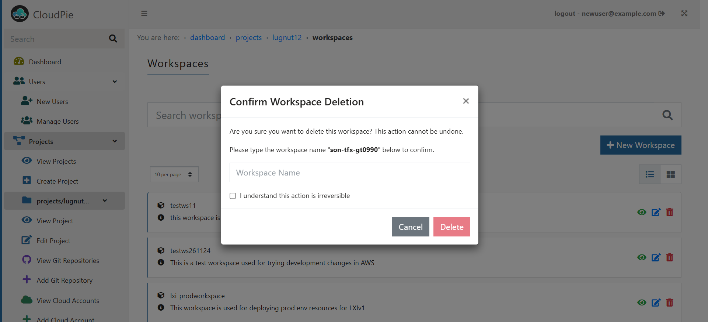

### Deleting a Workspace

To remove a workspace from Cloudpie, follow these steps:

1. **Access the Project:**
   - Navigate to the **Dashboard** and select the project containing the workspace you want to delete.
   - Once inside the project, locate and click on the **"View Workspaces"** menu in the sidebar.

2. **Search for the Workspace:**
   - Use the search bar to locate the specific workspace by its **Workspace Name**.

3. **Delete the Workspace:**
   - In the search results, click on the **Delete Workspace** icon next to the workspace you want to remove.

4. **Confirm Deletion:**
   - A confirmation box will appear. Carefully review the warning and confirm the deletion by clicking **Confirm**.

   > **Note:** Deleting a workspace is an **irreversible action**. All metadata and configurations related to the workspace will be permanently removed from Cloudpie including the associate Terraform Statefile.
   - **Your actual cloud resources will not be affected.**
   - This operation only removes the workspace’s association within Cloudpie and cleans up its metadata. 

***Example Image: Delete Workspace***

