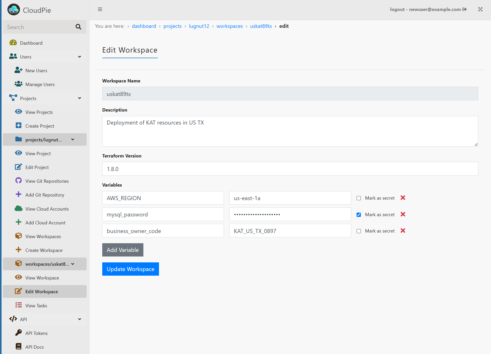

# Updating Workspaces

Learn how to modify existing workspace settings in CloudPie.

## Prerequisites
- Access to the CloudPie Dashboard
- Project-level permissions to edit workspaces
- Workspace must not have active deployments

## Editing Process

1. **Access the Workspace:**
   - Navigate to the **Dashboard**
   - Select your target project
   - Click **View Workspaces** in the sidebar
   - Locate the workspace you want to modify

2. **Open Edit Form:**
   - Click the edit (pencil) icon next to the workspace
   - The form will show current workspace settings

3. **Modify Settings:**
   You can update:
   - Workspace description
   - Terraform version
   - Associated Git repository
   - Linked cloud account
   - Variables and secrets

4. **Save Changes:**
   - Review your modifications
   - Click **Update Workspace** to apply changes

## Important Notes
- Workspace name cannot be changed after creation
- Changes may require workspace reinitialization
- Active deployments should be completed first
- Variable updates affect future runs only
- State files remain unchanged during edits

---