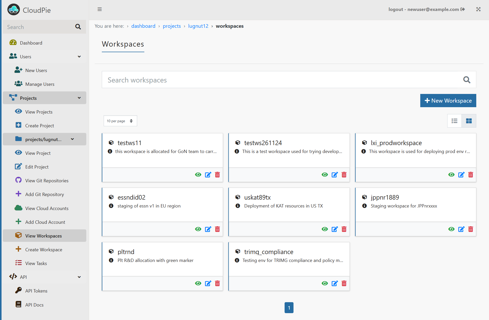
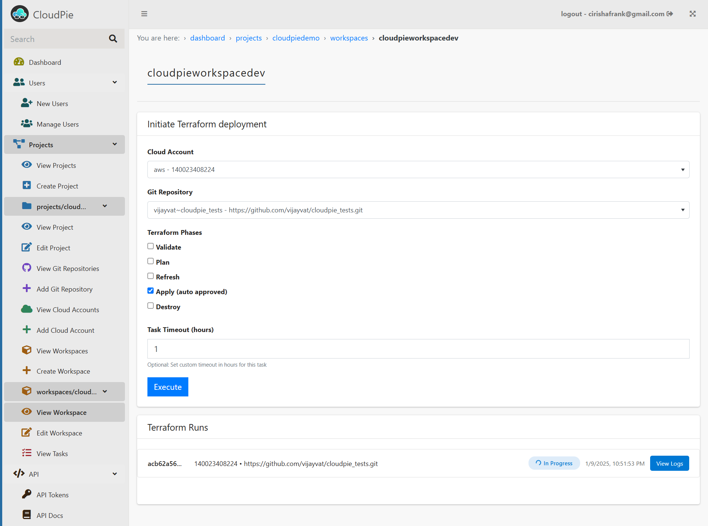
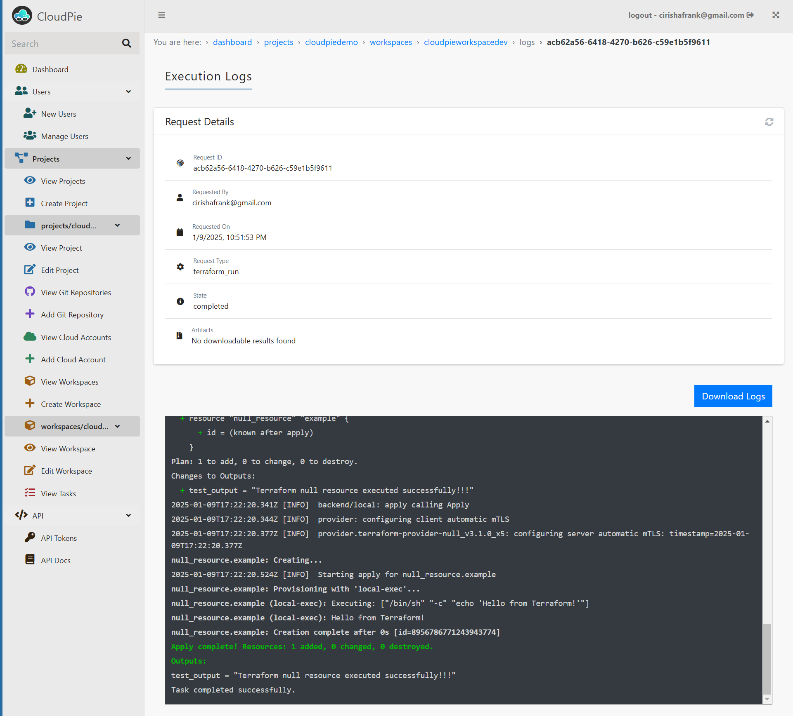

### Using Workspace to deploy workloads using Terraform

To view and manage workspaces associated with a project:

1. Navigate to the **Dashboard** and select the project you want to manage.
2. In the sidebar, click on the **"View Workspaces"** menu.
3. This will display a **paginated list** of all workspaces linked to the selected project.
4. Use the **Search bar** to quickly locate a specific workspace by its **Workspace Name**.
5. To narrow down the list, use the **Filter by Terraform Version** dropdown to display workspaces using a specific version.

***Example Image: View Workspaces***

---

### Deploy in workspace

To view details of a specific workspace:

1. From the **Workspaces** list, click on the **Settings icon** next to the workspace you want to view.
2. This will take you to the **Workspace Details Page**, which provides:
   - **High-level details** of the selected workspace, including its name, description, and Terraform version.
   - A **form to deploy Terraform code**, where you can:
     - Select one or more **Terraform phases** (e.g., `Validate`, `Plan`, `Apply`, etc.).
     - Choose a **Git repository** registered with the project that has the `terraform_config_path` parameter configured, specifying the path in the repository containing the Terraform code that you want to deploy.
     - Configure additional options, such as task timeout, if needed.

3. **Execute the Terraform Deployment:**
   - After filling out the form, click the **Execute** button to start the deployment.
   - The run request is tracked directly on the same page, with **real-time status updates**.

***Example Image: Workspace Details Page***

### Viewing Workspace execution Logs

Once the run starts, a **View Logs** button becomes available.

Click on the button to:

- **Tail Live Logs**: Monitor the logs in real time during the run.
- **View Completed Logs**: If you revisit later, access logs for completed runs.
- **Download Logs**: Download the full Terraform execution logs for offline analysis.

***Example Image: Workspace Details Page***

